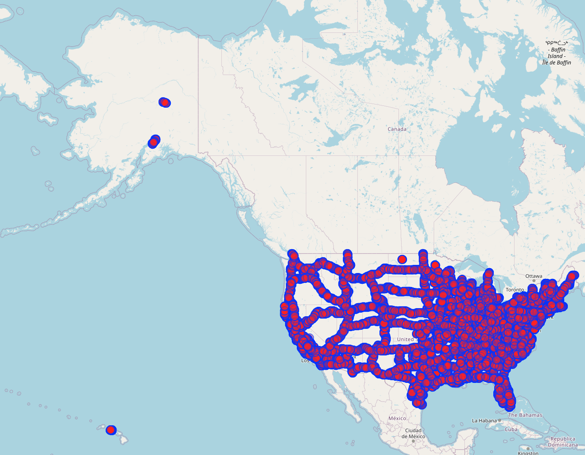

```{r setup, include=FALSE}
knitr::opts_chunk$set(echo=FALSE, message = FALSE, warning = FALSE)
```

<script src="https://ajax.googleapis.com/ajax/libs/jquery/3.5.1/jquery.min.js"></script>
<script src="data/script.js"></script>

<!--slide 1-->
<div class="slide">
<div class="controlli"><a href="#" class="prev">&#11013;</a>slide<a href="#" class="next">&#11157;</a></div>

# Intoduzione

Il dataset è stato costruito utilizzando l'API [https://overpass-turbo.eu](https://overpass-turbo.eu/).

<div class="img" id="img-osm"></div>

Grafo:
* nodi -> contee degli stati degli USA
* archi -> autostrada tra due contee

<div class="footer"><span class="autore">Gianluca Fabris</span><span class="titolo">USA OSM - Esame di Advanced data science</span></div>
</div>

```{r}
library(tidyr)
library(dplyr)
library(purrr)
library(readr)
library(stringr)
library(moments)
library(igraph)
library(tidygraph)
library(ggraph)
library(sf)
library(ggplot2)

#nomi stati
states = data.frame(
  name = c("Alaska", "Alabama", "Arkansas", "Arizona", "California", "Colorado", "Connecticut", "Washington District of Columbia", "Delaware", "Florida", "Georgia", "Hawaii", "Iowa", "Idaho", "Illinois", "Indiana", "Kansas", "Kentucky", "Louisiana", "Massachusetts", "Maryland", "Maine", "Michigan", "Minnesota", "Missouri", "Mississippi", "Montana", "North Carolina", "North Dakota", "Nebraska", "New Hampshire", "New Jersey", "New Mexico", "Nevada", "New York", "Ohio", "Oklahoma", "Oregon", "Pennsylvania", "Rhode Island", "South Carolina", "South Dakota", "Tennessee", "Texas", "Utah", "Virginia", "Vermont", "Washington", "Wisconsin", "West Virginia", "Wyoming"),
  abbr = c("AK", "AL", "AR", "AZ", "CA", "CO", "CT", "DC", "DE", "FL", "GA", "HI", "IA", "ID", "IL", "IN", "KS", "KY", "LA", "MA", "MD", "ME", "MI", "MN", "MO", "MS", "MT", "NC", "ND", "NE", "NH", "NJ", "NM", "NV", "NY", "OH", "OK", "OR", "PA", "RI", "SC", "SD", "TN", "TX", "UT", "VA", "VT", "WA", "WI", "WV", "WY")
)

```

```{r}
create_state_graph = function(state_nodes, state_edges){
  if(nrow(state_edges) == 0){
    graph = graph_from_data_frame(d = data.frame(u = character(0), v = character(0)), vertices = state_nodes %>% select(county, city_name, lat, lon) %>% rename(y = lat, x = lon), directed = FALSE)
    return(graph)
  }else{
    nodes = state_nodes %>%
      select(county, city_name, lat, lon, state) %>%
      rename(y = lat, x = lon) %>%
      distinct()
    edges = state_edges %>%
      select(county1, county2, dist) %>%
      distinct()
    graph = graph_from_data_frame(d = edges, vertices = nodes, directed = FALSE)
    return(graph)
  }
}

#leggi nodi
state_dirs = list.dirs("data/roads", recursive = FALSE)
nodes = map(state_dirs, ~ {
  csv_path = file.path(.x, "nodes.csv")
  if(file.exists(csv_path)){
    read_csv(csv_path, show_col_types = FALSE)
  }else{
    NULL
  }
})
names(nodes) = basename(state_dirs)

#leggi archi
state_dirs = list.dirs("data/roads", recursive = FALSE)
edges = map(state_dirs, ~ {
  csv_path = file.path(.x, "edges.csv")
  if(file.exists(csv_path)){
    read_csv(csv_path, show_col_types = FALSE)
  }else{
    NULL
  }
})
names(edges) = basename(state_dirs)
global_csv_path = file.path("data/roads", "edges.csv")
edges[["global"]] = read_csv(global_csv_path, show_col_types = FALSE)

#pulizia dati
words_to_remove = c("County", "Borough", "Parish", "Planning Region")

nodes$MD = nodes$MD %>%
  mutate(county = ifelse(county == "Baltimore", paste0(county, " City"), county))
edges$MD = edges$MD %>%
  mutate(county1 = ifelse(county1 == "Baltimore", paste0(county1, " City"), county1), county2 = ifelse(county2 == "Baltimore", paste0(county2, " City"), county2))

nodes$MO = nodes$MO %>%
  mutate(county = ifelse(county == "Saint Louis", paste0(county, " City"), county))
edges$MO = edges$MO %>%
  mutate(county1 = ifelse(county1 == "Saint Louis", paste0(county1, " City"), county1), county2 = ifelse(county2 == "Saint Louis", paste0(county2, " City"), county2))

nodes$VA = nodes$VA %>%
  mutate(county = ifelse(county == "Roanoke", paste0(county, " City"), county))
edges$VA = edges$VA %>%
  mutate(county1 = ifelse(county1 == "Roanoke", paste0(county1, " City"), county1), county2 = ifelse(county2 == "Roanoke", paste0(county2, " City"), county2))

nodes$VA = nodes$VA %>%
  mutate(county = ifelse(county == "Franklin", paste0(county, " City"), county))
edges$VA = edges$VA %>%
  mutate(county1 = ifelse(county1 == "Franklin", paste0(county1, " City"), county1), county2 = ifelse(county2 == "Franklin", paste0(county2, " City"), county2))

nodes = map(nodes, ~ .x %>%
  mutate(across(c(county, city_name), ~ str_remove_all(.x, str_c(words_to_remove, collapse = "|")) %>% str_trim()))
)

edges = map(edges, ~ if(nrow(.x) > 0 && ncol(.x) > 0){
    .x %>%
      mutate(across(c(county1, county2), ~ str_remove_all(.x, str_c(words_to_remove, collapse = "|")) %>% str_trim()))
  }else{
    .x
  }
)

#equirectangular projection
nodes = map(nodes, ~ .x %>%
  st_as_sf(coords = c("lon", "lat"), crs = 4326) %>%
  st_transform(crs = "+proj=eqc") %>%
  mutate(lon = st_coordinates(.)[, 1], lat = st_coordinates(.)[, 2]) %>%
  as.data.frame()
)

#distanze
edges[1:(length(edges) - 1)] = map2(edges[1:(length(edges) - 1)], nodes, ~ {
  if(nrow(.x) > 0){
    .x %>%
      left_join(.y, by = c("county1" = "county")) %>%
      rename(y_u = lat, x_u = lon) %>%
      left_join(.y, by = c("county2" = "county")) %>%
      rename(y_v = lat, x_v = lon) %>%
      mutate(dist = sqrt((x_v - x_u)^2 + (y_v - y_u)^2)) %>%
      select(county1, county2, dist)
  }else{
    .x
  }
})

edges$global = edges$global %>%
  left_join(states, by = c("state1" = "name")) %>%
  rename(state1_abbr = abbr) %>%
  left_join(states, by = c("state2" = "name")) %>%
  rename(state2_abbr = abbr) %>%
  select(-state1, -state2) %>%
  rename(state1 = state1_abbr, state2 = state2_abbr)

edges$global = edges$global %>%
  left_join(bind_rows(nodes, .id = "state"), by = c("state1" = "state", "county1" = "county")) %>%
  rename(y_u = lat, x_u = lon) %>%
  left_join(bind_rows(nodes, .id = "state"), by = c("state2" = "state", "county2" = "county")) %>%
  rename(y_v = lat, x_v = lon) %>%
  mutate(dist = sqrt((x_v - x_u)^2 + (y_v - y_u)^2)) %>%
  select(state1, county1, state2, county2, dist)

nodes = map(nodes, ~ .x %>%
  mutate(state = "")
)

#creazione grafi
roads_by_state = map2(nodes, edges[1:(length(edges) - 1)], create_state_graph)

nodes_global = bind_rows(imap_dfr(nodes, ~ .x %>%
  mutate(county = paste(.y, .x$county, sep = " - "), state = .y) %>%
  select(county, city_name, lat, lon, state) %>%
  distinct()))

edges_global = bind_rows(imap_dfr(edges[1:(length(edges) - 1)], ~ {
    if(nrow(.x) > 0){
      .x %>%
        mutate(county1 = paste(.y, .x$county1, sep = " - "),
               county2 = paste(.y, .x$county2, sep = " - ")) %>%
        select(county1, county2, dist) %>%
        distinct()
    }else{
      data.frame(county1 = character(0), county2 = character(0), dist = numeric(0))
    }
  }),
  bind_rows(
    edges$global %>%
      mutate(county1 = paste(.data$state1, .data$county1, sep = " - "),
             county2 = paste(.data$state2, .data$county2, sep = " - ")) %>%
      select(county1, county2, dist) %>%
      distinct()
  ))

roads = create_state_graph(nodes_global, edges_global)

roads_by_state_nodes = nodes
roads_by_state_edges = edges
roads_nodes = nodes_global
roads_edges = edges_global
rm(nodes)
rm(edges)
rm(nodes_global)
rm(edges_global)

```

```{r}
#local

centrality = function(g, state){
  data.frame(
    state = state,
    node = V(g)$name,
    degree = degree(g),
    degreeW = strength(g, weights = E(g)$dist),
    closeness = closeness(g, weights = (E(g)$dist+0.000001), normalized = TRUE),
    betweenness = betweenness(g, weights = (E(g)$dist+0.000001), normalized = TRUE),
    eigen = eigen_centrality(g, weights = E(g)$dist)$vector,
    katz = alpha_centrality(g, weights = E(g)$dist),
    pagerank = page_rank(g, weights = E(g)$dist)$vector #funziona su diretti
    #hits_a = authority_score(g, weights = E(g)$dist)$vector, #funziona solo su diretti
    #hits_h = hub_score(g, weights = E(g)$dist)$vector #funziona solo su diretti
  )
}

similarity = function(g, mode = "col"){
  if(ecount(g) == 0){
    return(list(cosine = NA, pearson = NA, global = NA))
  }
  A = as_adjacency_matrix(g, attr = "dist", sparse = FALSE)
  if(mode == "row"){
    A = t(A)
  }
  cosine = function(A){
    euclidean = function(x){
      sqrt(x %*% x)
    }
    D = diag(1/apply(A, 2, euclidean))
    S = D %*% t(A) %*% A %*% D
    return(S)
  }
  global = function(A){
    S = solve(diag(1, vcount(g)) - 0.85 / max(abs(eigen(A)$values)) * A)
    S = S - diag(diag(S))
    return(S)
  }
  return(list(cosine = cosine(A), pearson = cor(A), global = global(A)))
}

heterogeneity = function(g, mode = "col"){
  if(ecount(g) == 0){
    return(list(shannon = NA, simpson = NA))
  }
  A = as_adjacency_matrix(g, attr = "dist", sparse = FALSE)
  D = A
  if(mode == "col"){
    A = A %*% diag(1/colSums(A))
    dim = 2 
  }else{
    A = diag(1/rowSums(A)) %*% A
    dim = 1 
  }
  shannon = function(p){
    x = p * log2(p)
    x = replace(x, is.nan(x), 0)
    return(-sum(x))
  }
  simpson = function(p){
    x = 1 - sum(p * p)
    return(x)
  }
  # rao = function(p, D){ #lento su grafi grandi
  #   x = diag(p) %*% D %*% diag(p)
  #   return(sum(c(x)))
  # }
  return(list(shannon = apply(A, dim, shannon), simpson = apply(A, dim, simpson)))
}

#group

communities = function(g){
  methods = list(
    "edge_betweenness" = cluster_edge_betweenness,
    "fast_greedy" = cluster_fast_greedy,
    "label_prop" = cluster_label_prop,
    "leading_eigen" = cluster_leading_eigen,
    "louvain" = cluster_louvain,
    "walktrap" = cluster_walktrap,
    #"spinglass" = function(graph) cluster_spinglass(graph, spins = 10), #funziona solo su connesso
    "infomap" = cluster_infomap
    #"optimal" = cluster_optimal #lento su grafi grandi
  )
  do.call(rbind, lapply(names(methods), function(method) {
    tryCatch(
      data.frame(method = method, result = I(list(methods[[method]](g)))),
      error = function(e) {
        message("Error with method: ", method)
        data.frame(method = method, result = I(list(NA)))
      }
    )
  }))
}

clustering = function(g){
  methods = c("average", "centroid", "single", "complete")
  d = as.dist(as_adjacency_matrix(g, attr = "dist", sparse = FALSE))
  do.call(rbind, lapply(methods, function(method){
    data.frame(method = method, result = I(list(hclust(d, method = method))))
  }))
}

#global

connettivity = function(g){
  list(
    components = components(g),
    biconnected_components = biconnected_components(g),
    cohesive_blocks = cohesive_blocks(g)
  )
}

resilience = function(g){
  percolate = function(g, size, d){
    giant = vector()
    c = components(g)
    giant[1] = max(c$csize)
    names(d) = 1:length(d)
    d = sort(d, decreasing=TRUE)
    vital = as.integer(names(d[1:size]))
    for (i in 1:size) {
      c = components(delete_vertices(g, vital[1:i]))
      giant[i+1] = max(c$csize)
    }
    giant
  }
  size = floor(vcount(g)/2)
  c = centrality(g, "")
  data.frame(
    rand = percolate(g, size, d = sample(V(g), size)),
    degree = percolate(g, size, d = c$degree),
    degreeW = percolate(g, size, d = c$degreeW),
    closeness = percolate(g, size, d = c$closeness),
    betweenness = percolate(g, size, d = c$betweenness),
    eigen = percolate(g, size, d = c$eigen),
    katz = percolate(g, size, d = c$katz),
    pagerank = percolate(g, size, d = c$pagerank)
  )
}

geodesic = function(g, state){
  list(
    geodesic_mean = mean_distance(g),
    geodesic_diameter = diameter(g),
    geodesic_diameter_nodes = get_diameter(g)
  )
}

power_law = function(g){
  ccdf = function(d){
    p = rep(0, max(d))
    for (i in 1:length(p)) {
      p[i] = length(d[d >= i]) / length(d)
    } 
    p
  }
  d = degree(g)
  list(
    degreeD = d,
    distD = distances(g)[is.finite(distances(g))],
    summary = summary(d),
    skewness = skewness(d),
    ccdf = ccdf(d)
  )
}

assortativita = function(g, m, v){
  data.frame(
    assortativityE = modularity(g, membership = m),
    assortativityS = assortativity(roads, v),
    assortativityD = assortativity_degree(g)
  )
}

motif = function(g){
  data.frame(
    transitivity = transitivity(g, type = "global")
  )
}

```

<!--slide 2-->
<div class="slide">
<div class="controlli"><a href="#" class="prev">&#11013;</a>slide<a href="#" class="next">&#11157;</a></div>

# Analisi singoli stati e delle loro distribuzioni di centralità

```{r}
for(state in names(roads_by_state)[1:30]){
  state_map = map_data("county") %>%
    filter(region == ifelse(state == "DC", tolower("District of Columbia"), states %>% filter(abbr %in% state) %>% pull(name) %>% tolower())) %>%
    #equirectangular projection
    st_as_sf(coords = c("long", "lat"), crs = 4326) %>%
    st_transform(crs = "+proj=eqc") %>%
    mutate(x = st_coordinates(.)[, 1], y = st_coordinates(.)[, 2]) %>%
    as.data.frame()
  if(state == "AK"){
     state_map = read.csv("data/outline_AK_HI_county.csv") %>%
      filter(abbr == "AK") %>%
      mutate(x = x-15550000, y = y+8850000)
  }
  if(state == "HI"){
     state_map = read.csv("data/outline_AK_HI_county.csv") %>%
      filter(abbr == "HI") %>%
      mutate(x = x-17100000, y = y+4400000)
  }
  print(
    roads_by_state[[state]] %>%
      as_tbl_graph() %>%
      activate(nodes) %>%
      mutate(degree = centrality_degree()) %>%
      ggraph(layout = 'manual', x = x, y = y) + 
        geom_polygon(data = state_map, aes(x = x, y = y, group = group), fill = "#ebebeb", color="black") +
        geom_node_point(aes(size = degree/2, colour = degree)) +
        geom_edge_link() +
        #geom_node_text(aes(label = ifelse(degree > 3, name, ""))) +
        scale_x_continuous(guide = "none") +
        scale_y_continuous(guide = "none") +
        coord_fixed(ratio = 1) +
        scale_color_gradient(low="#6B9EE1", high="#86F5FA") +
        scale_size_continuous(guide = "none") +
        labs(title = states %>% filter(abbr %in% state) %>% pull(name), x = "", y = "", size = "", color = "Degree") +
        theme_minimal() +
        theme(axis.text.x=element_text(color="#000000"), axis.text.y=element_text(color="#000000"), axis.line=element_line(color="#000000"), panel.background=element_rect(fill="#ffffff"), panel.grid.major.x=element_line(colour="#ebebeb"), panel.grid.major.y=element_line(colour="#ebebeb"), plot.title=element_text(size=rel(1.5)))
  )
}
```

<div class="footer"><span class="autore">Gianluca Fabris</span><span class="titolo">USA OSM - Esame di Advanced data science</span></div>
</div>

<!--slide 3-->
<div class="slide">
<div class="controlli"><a href="#" class="prev">&#11013;</a>slide<a href="#" class="next">&#11157;</a></div>

```{r}
for(state in names(roads_by_state)[31:51]){
  state_map = map_data("county") %>%
    filter(region == ifelse(state == "DC", tolower("District of Columbia"), states %>% filter(abbr %in% state) %>% pull(name) %>% tolower())) %>%
    #equirectangular projection
    st_as_sf(coords = c("long", "lat"), crs = 4326) %>%
    st_transform(crs = "+proj=eqc") %>%
    mutate(x = st_coordinates(.)[, 1], y = st_coordinates(.)[, 2]) %>%
    as.data.frame()
  if(state == "AK"){
     state_map = read.csv("data/outline_AK_HI_county.csv") %>%
      filter(abbr == "AK") %>%
      mutate(x = x-15550000, y = y+8850000)
  }
  if(state == "HI"){
     state_map = read.csv("data/outline_AK_HI_county.csv") %>%
      filter(abbr == "HI") %>%
      mutate(x = x-17100000, y = y+4400000)
  }
  print(
    roads_by_state[[state]] %>%
      as_tbl_graph() %>%
      activate(nodes) %>%
      mutate(degree = centrality_degree()) %>%
      ggraph(layout = 'manual', x = x, y = y) + 
        geom_polygon(data = state_map, aes(x = x, y = y, group = group), fill = "#ebebeb", color="black") +
        geom_node_point(aes(size = degree/2, colour = degree)) +
        geom_edge_link() +
        #geom_node_text(aes(label = ifelse(degree > 3, name, ""))) +
        scale_x_continuous(guide = "none") +
        scale_y_continuous(guide = "none") +
        coord_fixed(ratio = 1) +
        scale_color_gradient(low="#6B9EE1", high="#86F5FA") +
        scale_size_continuous(guide = "none") +
        labs(title = states %>% filter(abbr %in% state) %>% pull(name), x = "", y = "", size = "", color = "Degree") +
        theme_minimal() +
        theme(axis.text.x=element_text(color="#000000"), axis.text.y=element_text(color="#000000"), axis.line=element_line(color="#000000"), panel.background=element_rect(fill="#ffffff"), panel.grid.major.x=element_line(colour="#ebebeb"), panel.grid.major.y=element_line(colour="#ebebeb"), plot.title=element_text(size=rel(1.5)))
  )
}
```

<div class="footer"><span class="autore">Gianluca Fabris</span><span class="titolo">USA OSM - Esame di Advanced data science</span></div>
</div>

<!--slide 43-->
<div class="slide">
<div class="controlli"><a href="#" class="prev">&#11013;</a>slide<a href="#" class="next">&#11157;</a></div>

## (Distribuzione delle) Centralità

```{r}
rbs_c = do.call(rbind, lapply(names(roads_by_state), function(state){
  centrality(roads_by_state[[state]], state)
}))

rbs_c %>%
  ggplot(aes(x=state, y=degree)) +
    geom_boxplot(color="#6B9EE1") +
    geom_point(data = rbs_c %>% group_by(state) %>% summarize(mean_degree = mean(degree)), aes(x = state, y = mean_degree, group = 1), color = "#86F5FA") + 
    scale_y_continuous() +
    labs(title = "Centalità grafi per stato", x = "Stato", y = "Degree (senza pesi)") +
    theme_minimal() +
    theme(axis.text.x=element_text(color="#000000", angle = 90, vjust = 0.5, hjust = 1), axis.text.y=element_text(color="#000000"), axis.line=element_line(color="#000000"), panel.background=element_rect(fill="#ffffff"), panel.grid.major.x=element_line(colour="#ebebeb"), panel.grid.major.y=element_line(colour="#ebebeb"), plot.title=element_text(size=rel(1.5)))

rbs_c %>%
  ggplot(aes(x=state, y=degreeW)) +
    geom_boxplot(color="#6B9EE1") +
    geom_point(data = rbs_c %>% group_by(state) %>% summarize(mean_degreeW = mean(degreeW)), aes(x = state, y = mean_degreeW, group = 1), color = "#86F5FA") + 
    scale_y_continuous() +
    labs(title = "Centalità grafi per stato", x = "Stato", y = "Degree") +
    theme_minimal() +
    theme(axis.text.x=element_text(color="#000000", angle = 90, vjust = 0.5, hjust = 1), axis.text.y=element_text(color="#000000"), axis.line=element_line(color="#000000"), panel.background=element_rect(fill="#ffffff"), panel.grid.major.x=element_line(colour="#ebebeb"), panel.grid.major.y=element_line(colour="#ebebeb"), plot.title=element_text(size=rel(1.5)))

rbs_c %>%
  ggplot(aes(x=state, y=closeness)) +
    geom_boxplot(color="#6B9EE1") +
    geom_point(data = rbs_c %>% group_by(state) %>% summarize(mean_closeness = mean(closeness)), aes(x = state, y = mean_closeness, group = 1), color = "#86F5FA") + 
    scale_y_continuous() +
    labs(title = "Centalità grafi per stato", x = "Stato", y = "Closeness") +
    theme_minimal() +
    theme(axis.text.x=element_text(color="#000000", angle = 90, vjust = 0.5, hjust = 1), axis.text.y=element_text(color="#000000"), axis.line=element_line(color="#000000"), panel.background=element_rect(fill="#ffffff"), panel.grid.major.x=element_line(colour="#ebebeb"), panel.grid.major.y=element_line(colour="#ebebeb"), plot.title=element_text(size=rel(1.5)))

rbs_c %>%
  ggplot(aes(x=state, y=betweenness)) +
    geom_boxplot(color="#6B9EE1") +
    geom_point(data = rbs_c %>% group_by(state) %>% summarize(mean_betweenness = mean(betweenness)), aes(x = state, y = mean_betweenness, group = 1), color = "#86F5FA") + 
    scale_y_continuous() +
    labs(title = "Centalità grafi per stato", x = "Stato", y = "Betweenness") +
    theme_minimal() +
    theme(axis.text.x=element_text(color="#000000", angle = 90, vjust = 0.5, hjust = 1), axis.text.y=element_text(color="#000000"), axis.line=element_line(color="#000000"), panel.background=element_rect(fill="#ffffff"), panel.grid.major.x=element_line(colour="#ebebeb"), panel.grid.major.y=element_line(colour="#ebebeb"), plot.title=element_text(size=rel(1.5)))

rbs_c %>%
  ggplot(aes(x=state, y=eigen)) +
    geom_boxplot(color="#6B9EE1") +
    geom_point(data = rbs_c %>% group_by(state) %>% summarize(mean_eigen = mean(eigen)), aes(x = state, y = mean_eigen, group = 1), color = "#86F5FA") + 
    scale_y_continuous() +
    labs(title = "Centalità grafi per stato", x = "Stato", y = "Eigenvector") +
    theme_minimal() +
    theme(axis.text.x=element_text(color="#000000", angle = 90, vjust = 0.5, hjust = 1), axis.text.y=element_text(color="#000000"), axis.line=element_line(color="#000000"), panel.background=element_rect(fill="#ffffff"), panel.grid.major.x=element_line(colour="#ebebeb"), panel.grid.major.y=element_line(colour="#ebebeb"), plot.title=element_text(size=rel(1.5)))

rbs_c %>%
  ggplot(aes(x=state, y=katz)) +
    geom_boxplot(color="#6B9EE1") +
    geom_point(data = rbs_c %>% group_by(state) %>% summarize(mean_katz = mean(katz)), aes(x = state, y = mean_katz, group = 1), color = "#86F5FA") + 
    scale_y_continuous() +
    labs(title = "Centalità grafi per stato", x = "Stato", y = "Katz") +
    theme_minimal() +
    theme(axis.text.x=element_text(color="#000000", angle = 90, vjust = 0.5, hjust = 1), axis.text.y=element_text(color="#000000"), axis.line=element_line(color="#000000"), panel.background=element_rect(fill="#ffffff"), panel.grid.major.x=element_line(colour="#ebebeb"), panel.grid.major.y=element_line(colour="#ebebeb"), plot.title=element_text(size=rel(1.5)))

rbs_c %>%
  ggplot(aes(x=state, y=pagerank)) +
    geom_boxplot(color="#6B9EE1") +
    geom_point(data = rbs_c %>% group_by(state) %>% summarize(mean_pagerank = mean(pagerank)), aes(x = state, y = mean_pagerank, group = 1), color = "#86F5FA") + 
    scale_y_continuous() +
    labs(title = "Centalità grafi per stato", x = "Stato", y = "Pagerank") +
    theme_minimal() +
    theme(axis.text.x=element_text(color="#000000", angle = 90, vjust = 0.5, hjust = 1), axis.text.y=element_text(color="#000000"), axis.line=element_line(color="#000000"), panel.background=element_rect(fill="#ffffff"), panel.grid.major.x=element_line(colour="#ebebeb"), panel.grid.major.y=element_line(colour="#ebebeb"), plot.title=element_text(size=rel(1.5)))

```

<div class="footer"><span class="autore">Gianluca Fabris</span><span class="titolo">USA OSM - Esame di Advanced data science</span></div>
</div>

<!--slide 5-->
<div class="slide">
<div class="controlli"><a href="#" class="prev">&#11013;</a>slide<a href="#" class="next">&#11157;</a></div>

# Analisi USA

```{r}
state_map = bind_rows(
  map_data("state") %>%
    #equirectangular projection
    st_as_sf(coords = c("long", "lat"), crs = 4326) %>%
    st_transform(crs = "+proj=eqc") %>%
    mutate(x = st_coordinates(.)[, 1], y = st_coordinates(.)[, 2]) %>%
    as.data.frame() %>%
    select(group, region, x, y),
  read.csv("data/outline_AK_HI_state.csv") %>%
    mutate(x = ifelse(abbr == "AK", x - 15550000, x), y = ifelse(abbr == "AK", y + 8850000, y)) %>%
    mutate(x = ifelse(abbr == "HI", x - 17100000, x), y = ifelse(abbr == "HI", y + 4400000, y)) %>%
    rename(region = full) %>%
    select(group, region, x, y)
)

roads %>%
  as_tbl_graph() %>%
  activate(nodes) %>%
  mutate(degree = centrality_degree()) %>%
  ggraph(layout = 'manual', x = x, y = y) +
    geom_polygon(data = state_map, aes(x = x, y = y, group = group), fill = "#ebebeb", color="black") +
    geom_node_point(aes(colour = state)) +
    geom_edge_link() +
    scale_x_continuous(guide = "none") +
    scale_y_continuous(guide = "none") +
    coord_fixed(ratio = 1) +
    labs(title = "USA", x = "", y = "", color = "State") +
    theme_minimal() +
    theme(axis.text.x=element_text(color="#000000"), axis.text.y=element_text(color="#000000"), axis.line=element_line(color="#000000"), panel.background=element_rect(fill="#ffffff"), panel.grid.major.x=element_line(colour="#ebebeb"), panel.grid.major.y=element_line(colour="#ebebeb"), plot.title=element_text(size=rel(1.5)))
```

<div class="footer"><span class="autore">Gianluca Fabris</span><span class="titolo">USA OSM - Esame di Advanced data science</span></div>
</div>

<!--slide 6-->
<div class="slide">
<div class="controlli"><a href="#" class="prev">&#11013;</a>slide<a href="#" class="next">&#11157;</a></div>

## Locale - centralità

```{r}
r_c = centrality(roads, "USA")

roads %>%
  ggraph(layout = 'manual', x = x, y = y) +
    geom_node_point(aes(size = I(r_c$degree/2), colour = r_c$degree)) +
    geom_edge_link() +
    scale_x_continuous(guide = "none") +
    scale_y_continuous(guide = "none") +
    coord_fixed(ratio = 1) +
    scale_color_gradient(low="#6B9EE1", high="#86F5FA") +
    scale_size_continuous(guide = "none") +
    labs(title = "USA - centralità", x = "X", y = "Y", size = "", colour = "Degree") +
    theme_minimal() +
    theme(axis.text.x=element_text(color="#000000"), axis.text.y=element_text(color="#000000"), axis.line=element_line(color="#000000"), panel.background=element_rect(fill="#ffffff"), panel.grid.major.x=element_line(colour="#ebebeb"), panel.grid.major.y=element_line(colour="#ebebeb"), plot.title=element_text(size=rel(1.5)))

roads %>%
  ggraph(layout = 'manual', x = x, y = y) +
    geom_node_point(aes(size = I(r_c$degreeW/150000), colour = r_c$degreeW)) +
    geom_edge_link() +
    scale_x_continuous(guide = "none") +
    scale_y_continuous(guide = "none") +
    coord_fixed(ratio = 1) +
    scale_color_gradient(low="#6B9EE1", high="#86F5FA") +
    scale_size_continuous(guide = "none") +
    labs(title = "USA - centralità", x = "X", y = "Y", size = "", colour = "Degree weighted") +
    theme_minimal() +
    theme(axis.text.x=element_text(color="#000000"), axis.text.y=element_text(color="#000000"), axis.line=element_line(color="#000000"), panel.background=element_rect(fill="#ffffff"), panel.grid.major.x=element_line(colour="#ebebeb"), panel.grid.major.y=element_line(colour="#ebebeb"), plot.title=element_text(size=rel(1.5)))

roads %>%
  ggraph(layout = 'manual', x = x, y = y) +
    geom_node_point(aes(size = I(r_c$closeness*50000), colour = r_c$closeness)) +
    geom_edge_link() +
    scale_x_continuous(guide = "none") +
    scale_y_continuous(guide = "none") +
    coord_fixed(ratio = 1) +
    scale_color_gradient(low="#6B9EE1", high="#86F5FA") +
    scale_size_continuous(guide = "none") +
    labs(title = "USA - centralità", x = "X", y = "Y", size = "", colour = "Closeness") +
    theme_minimal() +
    theme(axis.text.x=element_text(color="#000000"), axis.text.y=element_text(color="#000000"), axis.line=element_line(color="#000000"), panel.background=element_rect(fill="#ffffff"), panel.grid.major.x=element_line(colour="#ebebeb"), panel.grid.major.y=element_line(colour="#ebebeb"), plot.title=element_text(size=rel(1.5)))

roads %>%
  ggraph(layout = 'manual', x = x, y = y) +
    geom_node_point(aes(size = I(r_c$betweenness*25), colour = r_c$betweenness)) +
    geom_edge_link() +
    scale_x_continuous(guide = "none") +
    scale_y_continuous(guide = "none") +
    coord_fixed(ratio = 1) +
    scale_color_gradient(low="#6B9EE1", high="#86F5FA") +
    scale_size_continuous(guide = "none") +
    labs(title = "USA - centralità", x = "X", y = "Y", size = "", colour = "Betweeness") +
    theme_minimal() +
    theme(axis.text.x=element_text(color="#000000"), axis.text.y=element_text(color="#000000"), axis.line=element_line(color="#000000"), panel.background=element_rect(fill="#ffffff"), panel.grid.major.x=element_line(colour="#ebebeb"), panel.grid.major.y=element_line(colour="#ebebeb"), plot.title=element_text(size=rel(1.5)))

roads %>%
  ggraph(layout = 'manual', x = x, y = y) +
    geom_node_point(aes(size = I(r_c$eigen*5), colour = r_c$eigen)) +
    geom_edge_link() +
    scale_x_continuous(guide = "none") +
    scale_y_continuous(guide = "none") +
    coord_fixed(ratio = 1) +
    scale_color_gradient(low="#6B9EE1", high="#86F5FA") +
    scale_size_continuous(guide = "none") +
    labs(title = "USA - centralità", x = "X", y = "Y", size = "", colour = "Eigenvector") +
    theme_minimal() +
    theme(axis.text.x=element_text(color="#000000"), axis.text.y=element_text(color="#000000"), axis.line=element_line(color="#000000"), panel.background=element_rect(fill="#ffffff"), panel.grid.major.x=element_line(colour="#ebebeb"), panel.grid.major.y=element_line(colour="#ebebeb"), plot.title=element_text(size=rel(1.5)))

roads %>%
  ggraph(layout = 'manual', x = x, y = y) +
    geom_node_point(aes(size = I(r_c$katz+0.5), colour = r_c$katz)) +
    geom_edge_link() +
    scale_x_continuous(guide = "none") +
    scale_y_continuous(guide = "none") +
    coord_fixed(ratio = 1) +
    scale_color_gradient(low="#6B9EE1", high="#86F5FA") +
    scale_size_continuous(guide = "none") +
    labs(title = "USA - centralità", x = "X", y = "Y", size = "", colour = "Katz") +
    theme_minimal() +
    theme(axis.text.x=element_text(color="#000000"), axis.text.y=element_text(color="#000000"), axis.line=element_line(color="#000000"), panel.background=element_rect(fill="#ffffff"), panel.grid.major.x=element_line(colour="#ebebeb"), panel.grid.major.y=element_line(colour="#ebebeb"), plot.title=element_text(size=rel(1.5)))

roads %>%
  ggraph(layout = 'manual', x = x, y = y) +
    geom_node_point(aes(size = I(r_c$pagerank*2000), colour = r_c$pagerank)) +
    geom_edge_link() +
    scale_x_continuous(guide = "none") +
    scale_y_continuous(guide = "none") +
    coord_fixed(ratio = 1) +
    scale_color_gradient(low="#6B9EE1", high="#86F5FA") +
    scale_size_continuous(guide = "none") +
    labs(title = "USA - centralità", x = "X", y = "Y", size = "", colour = "Pagerank") +
    theme_minimal() +
    theme(axis.text.x=element_text(color="#000000"), axis.text.y=element_text(color="#000000"), axis.line=element_line(color="#000000"), panel.background=element_rect(fill="#ffffff"), panel.grid.major.x=element_line(colour="#ebebeb"), panel.grid.major.y=element_line(colour="#ebebeb"), plot.title=element_text(size=rel(1.5)))
```

## Locale - similarità e eterogeneità

```{r}
r_s = similarity(roads)
r_h = heterogeneity(roads)

# graph_from_adjacency_matrix(r_s$cosine, mode = "undirected", weighted = TRUE) %>%
#   as_tbl_graph() %>%
#   mutate(x = vertex.attributes(roads)$x, y = vertex.attributes(roads)$y) %>%
#   ggraph(layout = 'manual', x = x, y = y) +
#     #geom_node_point()+
#     geom_edge_link(aes(alpha = weight/2, filter = (weight > quantile(weight, 0.999, na.rm = TRUE)))) + 
#     scale_x_continuous(guide = "none") +
#     scale_y_continuous(guide = "none") +
#     coord_fixed(ratio = 1) +
#     scale_edge_alpha_continuous(guide = "none") +
#     labs(title = "USA - similarità coseno", x = "X", y = "Y", edge_alpha = "") +
#     theme_minimal() +
#     theme(axis.text.x=element_text(color="#000000"), axis.text.y=element_text(color="#000000"), axis.line=element_line(color="#000000"), panel.background=element_rect(fill="#ffffff"), panel.grid.major.x=element_line(colour="#ebebeb"), panel.grid.major.y=element_line(colour="#ebebeb"), plot.title=element_text(size=rel(1.5)))
# 
# graph_from_adjacency_matrix(r_s$pearson, mode = "undirected", weighted = TRUE) %>%
#   as_tbl_graph() %>%
#   mutate(x = vertex.attributes(roads)$x, y = vertex.attributes(roads)$y) %>%
#   ggraph(layout = 'manual', x = x, y = y) +
#     #geom_node_point()+
#     geom_edge_link(aes(alpha = weight/2, filter = (weight > quantile(weight, 0.999, na.rm = TRUE)))) + 
#     scale_x_continuous(guide = "none") +
#     scale_y_continuous(guide = "none") +
#     coord_fixed(ratio = 1) +
#     scale_edge_alpha_continuous(guide = "none") +
#     labs(title = "USA - similarità pearson", x = "X", y = "Y", edge_alpha = "") +
#     theme_minimal() +
#     theme(axis.text.x=element_text(color="#000000"), axis.text.y=element_text(color="#000000"), axis.line=element_line(color="#000000"), panel.background=element_rect(fill="#ffffff"), panel.grid.major.x=element_line(colour="#ebebeb"), panel.grid.major.y=element_line(colour="#ebebeb"), plot.title=element_text(size=rel(1.5)))

graph_from_adjacency_matrix(r_s$global, mode = "undirected", weighted = TRUE) %>%
  as_tbl_graph() %>%
  mutate(x = vertex.attributes(roads)$x, y = vertex.attributes(roads)$y) %>%
  ggraph(layout = 'manual', x = x, y = y) +
    #geom_node_point()+
    geom_edge_link(aes(alpha = weight/2, filter = (weight > quantile(weight, 0.999, na.rm = TRUE)))) + 
    scale_x_continuous(guide = "none") +
    scale_y_continuous(guide = "none") +
    coord_fixed(ratio = 1) +
    scale_edge_alpha_continuous(guide = "none") +
    labs(title = "USA - similarità globale", x = "X", y = "Y", edge_alpha = "") +
    theme_minimal() +
    theme(axis.text.x=element_text(color="#000000"), axis.text.y=element_text(color="#000000"), axis.line=element_line(color="#000000"), panel.background=element_rect(fill="#ffffff"), panel.grid.major.x=element_line(colour="#ebebeb"), panel.grid.major.y=element_line(colour="#ebebeb"), plot.title=element_text(size=rel(1.5)))

roads %>%
  ggraph(layout = 'manual', x = x, y = y) +
    geom_node_point(aes(size = I(r_h$shannon), colour = r_h$shannon))+
    geom_edge_link() + 
    scale_x_continuous(guide = "none") +
    scale_y_continuous(guide = "none") +
    coord_fixed(ratio = 1) +
    scale_color_gradient(low="#6B9EE1", high="#86F5FA") +
    scale_size_continuous(guide = "none") +
    labs(title = "USA - eterogeneità", x = "X", y = "Y", size = "", colour = "Shannon") +
    theme_minimal() +
    theme(axis.text.x=element_text(color="#000000"), axis.text.y=element_text(color="#000000"), axis.line=element_line(color="#000000"), panel.background=element_rect(fill="#ffffff"), panel.grid.major.x=element_line(colour="#ebebeb"), panel.grid.major.y=element_line(colour="#ebebeb"), plot.title=element_text(size=rel(1.5)))

roads %>%
  ggraph(layout = 'manual', x = x, y = y) +
    geom_node_point(aes(size = I(r_h$simpson), colour = r_h$shannon))+
    geom_edge_link() + 
    scale_x_continuous(guide = "none") +
    scale_y_continuous(guide = "none") +
    coord_fixed(ratio = 1) +
    scale_color_gradient(low="#6B9EE1", high="#86F5FA") +
    scale_size_continuous(guide = "none") +
    labs(title = "USA - eterogeneità", x = "X", y = "Y", size = "", colour = "Simpson") +
    theme_minimal() +
    theme(axis.text.x=element_text(color="#000000"), axis.text.y=element_text(color="#000000"), axis.line=element_line(color="#000000"), panel.background=element_rect(fill="#ffffff"), panel.grid.major.x=element_line(colour="#ebebeb"), panel.grid.major.y=element_line(colour="#ebebeb"), plot.title=element_text(size=rel(1.5)))
```

<div class="footer"><span class="autore">Gianluca Fabris</span><span class="titolo">USA OSM - Esame di Advanced data science</span></div>
</div>

<!--slide 7-->
<div class="slide">
<div class="controlli"><a href="#" class="prev">&#11013;</a>slide<a href="#" class="next">&#11157;</a></div>

## Gruppi - comunità e clustering

```{r}
#creazione grafo fully connected per clustering
edges = expand.grid(county1 = as.character(roads_nodes$county), county2 = as.character(roads_nodes$county), stringsAsFactors = FALSE)
edges = edges[edges$county1 < edges$county2, ]
edges = edges %>%
  left_join(roads_nodes, by = c("county1" = "county")) %>%
  rename(y_u = lat, x_u = lon) %>%
  left_join(roads_nodes, by = c("county2" = "county")) %>%
  rename(y_v = lat, x_v = lon) %>%
  mutate(dist = sqrt((x_v - x_u)^2 + (y_v - y_u)^2)) %>%
  select(county1, county2, dist)

roads_FC = create_state_graph(roads_nodes, edges)

roads_edges_FC = edges
rm(edges)

r_co = communities(roads)
r_cl = clustering(roads_FC)

for(i in 1:nrow(r_co)){
  print(paste("Comunità", r_co$method[[i]], ": modularità", modularity(r_co$result[[i]]), "numero comunità", length(r_co$result[[i]])))
  print(
    roads %>%
      ggraph(layout = 'manual', x = x, y = y) +
        geom_node_point(aes(colour = factor(membership(r_co$result[[i]])))) +
        geom_edge_link(aes(colour = crossing(r_co$result[[i]], roads))) +
        scale_x_continuous(guide = "none") +
        scale_y_continuous(guide = "none") +
        coord_fixed(ratio = 1) +
        scale_color_discrete(guide = "none") +
        scale_edge_color_manual(values = c("TRUE" = "#86F5FA", "FALSE" = "#000000"), guide = "none") +
        labs(title = paste("USA - comunità", r_co$method[[i]]), x = "X", y = "Y", color = "", edge_color = "") +
        theme_minimal() +
        theme(axis.text.x=element_text(color="#000000"), axis.text.y=element_text(color="#000000"), axis.line=element_line(color="#000000"), panel.background=element_rect(fill="#ffffff"), panel.grid.major.x=element_line(colour="#ebebeb"), panel.grid.major.y=element_line(colour="#ebebeb"), plot.title=element_text(size=rel(1.5)))
  )
}
```

<div class="footer"><span class="autore">Gianluca Fabris</span><span class="titolo">USA OSM - Esame di Advanced data science</span></div>
</div>

<!--slide 8-->
<div class="slide">
<div class="controlli"><a href="#" class="prev">&#11013;</a>slide<a href="#" class="next">&#11157;</a></div>=

```{r}
for(i in 1:nrow(r_cl)){
  r_cl$result[[i]]$labels = rep("", length(r_cl$result[[1]]$labels))
  plot(r_cl$result[[i]], hang=-1)
  rect.hclust(r_cl$result[[i]], k = 51, border="#86F5FA")
  print(
    roads %>%
      ggraph(layout = 'manual', x = x, y = y) +
        geom_node_point(aes(colour = factor(cutree(r_cl$result[[i]], k = 51)))) +
        geom_edge_link() +
        scale_x_continuous(guide = "none") +
        scale_y_continuous(guide = "none") +
        coord_fixed(ratio = 1) +
        scale_color_discrete(guide = "none") +
        labs(title = paste("USA - cluster", r_cl$method[[i]]), x = "X", y = "Y", color = "") +
        theme_minimal() +
        theme(axis.text.x=element_text(color="#000000"), axis.text.y=element_text(color="#000000"), axis.line=element_line(color="#000000"), panel.background=element_rect(fill="#ffffff"), panel.grid.major.x=element_line(colour="#ebebeb"), panel.grid.major.y=element_line(colour="#ebebeb"), plot.title=element_text(size=rel(1.5)))
  )
}

```

<div class="footer"><span class="autore">Gianluca Fabris</span><span class="titolo">USA OSM - Esame di Advanced data science</span></div>
</div>

<!--slide 9-->
<div class="slide">
<div class="controlli"><a href="#" class="prev">&#11013;</a>slide<a href="#" class="next">&#11157;</a></div>

## Globale - connettività e resilienza

```{r}
r_con = connettivity(roads)
r_r = resilience(roads)

print(paste("componenti: numero componenti", r_con$components$no, "la più grande raggiunge il", round(max(r_con$components$csize)/vcount(roads)*100, 2), "% dei nodi"))

roads %>%
  ggraph(layout = 'manual', x = x, y = y) +
    geom_node_point(aes(colour = factor(r_con$components$membership))) +
    geom_edge_link() +
    scale_x_continuous(guide = "none") +
    scale_y_continuous(guide = "none") +
    coord_fixed(ratio = 1) +
    scale_color_discrete(guide = "none") +
    labs(title = "USA - componenti", x = "X", y = "Y", color = "") +
    theme_minimal() +
    theme(axis.text.x=element_text(color="#000000"), axis.text.y=element_text(color="#000000"), axis.line=element_line(color="#000000"), panel.background=element_rect(fill="#ffffff"), panel.grid.major.x=element_line(colour="#ebebeb"), panel.grid.major.y=element_line(colour="#ebebeb"), plot.title=element_text(size=rel(1.5)))

print(paste("componenti: numero componenti biconnesse", r_con$biconnected_components$no, "la più grande raggiunge il", round(max(sapply(r_con$biconnected_components, length))/vcount(roads)*100, 2), "% dei nodi"))

node_bicomponent = rep(NA, vcount(roads))
for(i in seq_along(r_con$biconnected_components$components)){
  node_bicomponent[r_con$biconnected_components$components[[i]]] = i
}

roads %>%
  as_tbl_graph() %>%
  activate(nodes) %>%
  mutate(biconnected_component = as.factor(node_bicomponent)) %>%
  ggraph(layout = 'manual', x = x, y = y) +
    geom_node_point(aes(colour = biconnected_component)) +
    geom_edge_link() +
    scale_x_continuous(guide = "none") +
    scale_y_continuous(guide = "none") +
    coord_fixed(ratio = 1) +
    scale_color_discrete(guide = "none") +
    labs(title = "USA - componenti biconnesse", x = "X", y = "Y", color = "") +
    theme_minimal() +
    theme(axis.text.x=element_text(color="#000000"), axis.text.y=element_text(color="#000000"), axis.line=element_line(color="#000000"), panel.background=element_rect(fill="#ffffff"), panel.grid.major.x=element_line(colour="#ebebeb"), panel.grid.major.y=element_line(colour="#ebebeb"), plot.title=element_text(size=rel(1.5)))

# plot_hierarchy(r_con$cohesive_blocks)
# blocks(r_con$cohesive_blocks)
# graphs_from_cohesive_blocks(r_con$cohesive_blocks, roads)
# cohesion(r_con$cohesive_blocks)

r_r %>%
  as_tibble() %>%
  mutate(removed_nodes = 0:floor(vcount(roads)/2)) %>%
  pivot_longer(cols = -removed_nodes, names_to = "metric", values_to = "value") %>%
  ggplot(aes(x = removed_nodes, y = value, color = metric)) +
    geom_line(size = 1) +
    geom_hline(yintercept = floor(vcount(roads)/2), linetype = "dashed", color = "black", size = 0.8) +
    labs(title = "USA - resilienza", x = "# nodi rimossi", y = "Dim componente gigante", color = "Centralità") +
    theme_minimal() +
    theme(axis.text.x=element_text(color="#000000"), axis.text.y=element_text(color="#000000"), axis.line=element_line(color="#000000"), panel.background=element_rect(fill="#ffffff"), panel.grid.major.x=element_line(colour="#ebebeb"), panel.grid.major.y=element_line(colour="#ebebeb"), plot.title=element_text(size=rel(1.5)))

```

<div class="footer"><span class="autore">Gianluca Fabris</span><span class="titolo">USA OSM - Esame di Advanced data science</span></div>
</div>

<!--slide 10-->
<div class="slide">
<div class="controlli"><a href="#" class="prev">&#11013;</a>slide&nbsp;&nbsp;&nbsp;&nbsp;</div>

## Globale - geodesica

```{r}
r_g = geodesic(roads)

print(paste("geodesica: media", r_g$geodesic_mean, "diametro", r_g$geodesic_diameter))

roads %>%
  ggraph(layout = 'manual', x = x, y = y) +
    geom_node_point(aes(colour = vertex.attributes(roads)$name %in% r_g$geodesic_diameter_nodes$name)) +
    geom_edge_link() +
    scale_x_continuous(guide = "none") +
    scale_y_continuous(guide = "none") +
    coord_fixed(ratio = 1) +
    scale_color_manual(values = c("TRUE" = "#86F5FA", "FALSE" = "#6B9EE1"), guide = "none") +
    labs(title = "USA - geodesica diametro", x = "X", y = "Y", color = "") +
    theme_minimal() +
    theme(axis.text.x=element_text(color="#000000"), axis.text.y=element_text(color="#000000"), axis.line=element_line(color="#000000"), panel.background=element_rect(fill="#ffffff"), panel.grid.major.x=element_line(colour="#ebebeb"), panel.grid.major.y=element_line(colour="#ebebeb"), plot.title=element_text(size=rel(1.5)))
```

## Globale - power law

```{r}
r_p = power_law(roads)

data.frame(degreeD = r_p$degreeD) %>%
  ggplot(aes(x = degreeD)) +
    geom_histogram(binwidth = 1, fill = "#6B9EE1", color = "black") +
    labs(title = "USA - distribuzione gradi", x = "Degree", y = "Frequenza") +
    theme_minimal() +
    theme(axis.text.x=element_text(color="#000000"), axis.text.y=element_text(color="#000000"), axis.line=element_line(color="#000000"), panel.background=element_rect(fill="#ffffff"), panel.grid.major.x=element_line(colour="#ebebeb"), panel.grid.major.y=element_line(colour="#ebebeb"), plot.title=element_text(size=rel(1.5)))


data.frame(distD = r_p$distD) %>%
  ggplot(aes(x = distD)) +
    geom_histogram(binwidth = 1, fill = "#6B9EE1", color = "black") +
    labs(title = "USA - distribuzione distanze", x = "Distanza", y = "Frequenza") +
    theme_minimal() +
    theme(axis.text.x=element_text(color="#000000"), axis.text.y=element_text(color="#000000"), axis.line=element_line(color="#000000"), panel.background=element_rect(fill="#ffffff"), panel.grid.major.x=element_line(colour="#ebebeb"), panel.grid.major.y=element_line(colour="#ebebeb"), plot.title=element_text(size=rel(1.5)))

r_p$summary
r_p$skewness

data.frame(x = 1:max(r_c$degree), y = r_p$ccdf) %>%
  ggplot(aes(x = 1:max(r_c$degree), y = r_p$ccdf)) +
    geom_line(color = "#6B9EE1") +
    scale_x_log10() +
    scale_y_log10() +
    labs(title = "USA - CCDF", x = "Degree", y = "CCDF") +
    theme_minimal() +
    theme(axis.text.x=element_text(color="#000000"), axis.text.y=element_text(color="#000000"), axis.line=element_line(color="#000000"), panel.background=element_rect(fill="#ffffff"), panel.grid.major.x=element_line(colour="#ebebeb"), panel.grid.major.y=element_line(colour="#ebebeb"), plot.title=element_text(size=rel(1.5)))

```

## Globale - assortatività

```{r}
r_a = assortativita(roads, as.numeric(factor(vertex.attributes(roads)$state)), degree(roads))

print(paste("assortatività: grado", round(r_a$assortativityD[1],2)))

```

## Globale - motivi

```{r}
r_m = motif(roads)

print(paste("motivi: transitività", round(r_m$transitivity[1],2)))

```

<div class="footer"><span class="autore">Gianluca Fabris</span><span class="titolo">USA OSM - Esame di Advanced data science</span></div>
</div>
